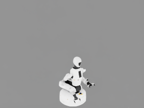
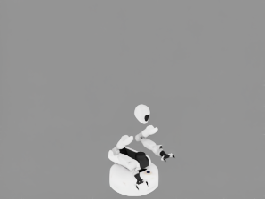

# Confirmed local reproduction

The default backend combination reproduced the issue in a 10-frame headless run.
At step 7, environment 1 was missing part of the left shoulder/upper-arm silhouette
while environment 0 rendered the synchronized reference pose correctly.

The detector measured 399 differing silhouette pixels in the current frame and
352 pixels that differed at the same locations for three consecutive frames. The
maximum RGB-channel difference was 211.

The Newton simulation state was still synchronized:

- maximum body-position delta: `9.5367431640625e-07 m`;
- maximum joint-position delta: `3.4552067518234253e-06 rad`;
- minimum absolute body-quaternion dot product: `0.9999998807907104`;
- all sampled body, quaternion, and joint values finite.

`stage_visibility.json` contains no invisible robot prims. `newton_viewer.png`
shows all four robots in the Newton geometry view, while the OVRTX camera image for
environment 1 has the missing geometry. Exact camera and articulation samples are
in `camera_state.json` and `robot_state.json`; package, GPU, arguments, and asset
hash are in `run_info.json`. The detector values above are in `detection.json`.

During startup, RTX also emitted a warning that Fabric transform reads combined
with geometry streaming can cause dynamic objects not to stream correctly because
of transform-update problems.
