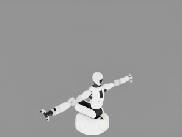
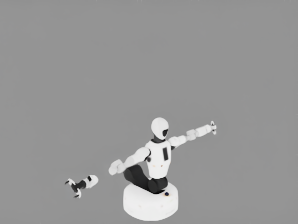
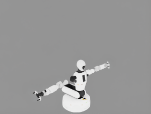
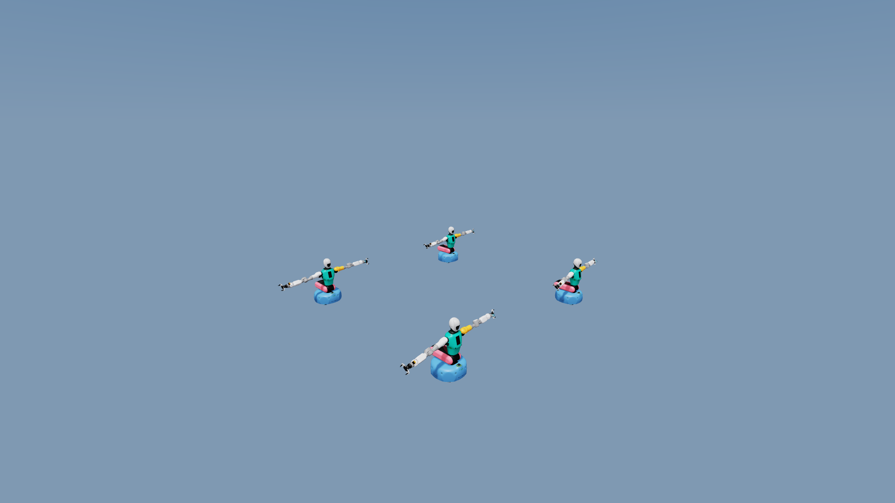

# Corrected CPU-versus-GPU evidence

The first published comparison incorrectly treated environment zero as a complete
reference. Visual review showed that it was also missing geometry. Those files are
retained under `superseded/` to make the correction explicit.

The images below use the same asset, environment index, camera, outstretched pose,
seed, and simulation step in two fresh processes. The only intended renderer
difference is the value actually passed to OVRTX's
`RendererConfig.read_gpu_transforms`.

| Effective CPU transform read (`False`) | GPU/Fabric transform read (`True`) |
|---|---|
|  |  |

The GPU/Fabric frame visibly loses a left-arm link. Compared with the complete
CPU frame, environment 2 has 787 pixels with a maximum-channel error above 40,
600 above 80, and 408 above 120; the maximum channel error is 218. Environment 0
in the same failing run also loses shoulder geometry:

This is why a same-frame `env_0` silhouette is not a valid absolute reference.
All per-environment fixed-reference measurements are in `comparison.json`.

## What the environment-variable experiment proves

The production installation was Isaac Lab `v3.0.0-beta2.patch1` at
`ffff603eafc6b74264a5261cc0183d6a65390d78`, `isaaclab-ov==0.4.2`, and OVRTX
runtime `0.3.0.312915`. Its adapter passes
`read_gpu_transforms=_IS_OVRTX_0_3_0_OR_NEWER` and does not read
`ISAAC_LAB_OVRTX_READ_GPU_TRANSFORMS`.

With that unmodified adapter, setting the variable to `0` was therefore a no-op.
RTX emitted its warning about Fabric transform reads plus geometry streaming, and
the corrected outstretched-pose run reproduced at step 7. `failure_run_info.json`
records `honors_read_gpu_transforms_env: false`; the failure detector reported 323
differing silhouette pixels, 203 persistent for three frames, with finite and
synchronized Newton state.

After applying the included backport so the same `0` reaches `RendererConfig` as
`False`, the RTX incompatibility warning disappeared and three independent
1,000-step processes completed with `reproduced=False`. A separate eight-step run
produced the complete reference image above; `reference_run_info.json` records
`honors_read_gpu_transforms_env: true` and the requested value `0`.

This result supports the CPU-read workaround. It does **not** show that the Fabric
bug is fixed in OVRTX 0.4, because the installed OVRTX runtime in this experiment
is 0.3.0.

The failure capture also includes the Newton viewer framebuffer, exact camera and
articulation state, USD visibility result, and run metadata. USD reported no
invisible robot prims while the OVRTX RGB output was missing geometry.

